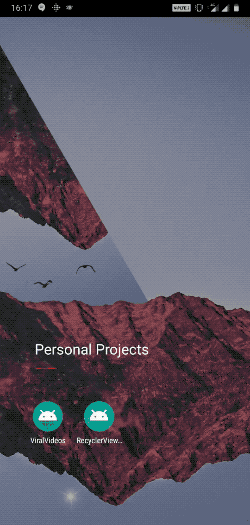

# recyclerviewexample-android

Application Name : Movie Info

Built on Android Studio
- Minimum SDK - 19
- Target SDK - 26
- Language - Java

Demo:

Features :

- Request json data information about countries from the following https://restcountries.eu/rest/v2/all and displayed on a recyclerView.
- It uses custom swipe to remove elements (on fast swipe) or adds them to pending removing list (on dragging a listelement half way) adding a delete/remove icon to the view.
